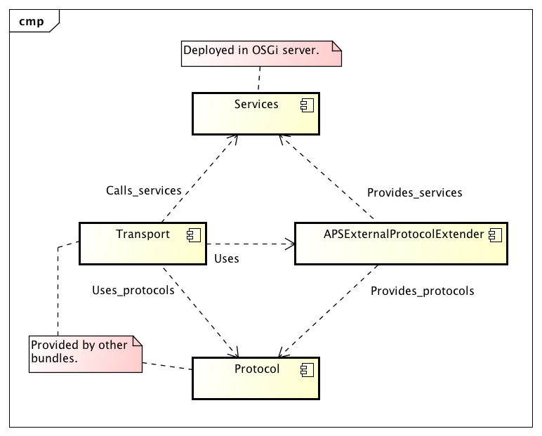

# APSExternalProtocolExtender

This is an OSGi bundle that makes use of the OSGi extender pattern. It listens to services being registered and unregistered and if the services bundles _MANIFEST.MF_ contains ”APS-Externalizable: true” the service is made externally available. If the _MANIFEST.MF_ contains ”APS-Externalizable: false” however making the service externally available is forbidden.

The exernal protocol extender also provides a configuration where services can be specified with their fully qualified name to be made externally available. If a bundle however have specifically specified false for the above manifest entry then the config entry will be ignored.

So, what is meant by ”made externally available” ? Well what this bundle does is to analyze with reflection all services that are in one way or the other specified as being externalizable (manifest or config) and for all callable methods of the service an _APSExternallyCallable_ object will be created and saved locally with the service name. _APSExternallyCallable_ extends _java.util.concurrent.Callable_, and adds the possibility to add parameters to calls and also provides meta data for the service method, and the bundle it belongs to.

## The overall structure

The complete picture for making services externally callable looks like this:

This bundle provides the glue between the services and the protocols. Transports and protocols have to be provided by other bundles.

The flow is like this:

1. Transport gets some request and an InputStream.

2. Transport gets some user selected protocol (The APSExtProtocolHTTPTransportProvider allows specification of both protocol, protocol version, and service to call in the URL).

3. Transport calls APSExternalProtocolService to get requested protocol.

4. Transport calls protocol to parse InputStream and it returns an RPCRequest.

5. Transport uses the information in the RPCRequest to call a service using APSExternalProtocolService.

6. Transport takes the result from the call and passes to the protocol along with an OutputStream to write response on.

## APSExternalProtocolService

This bundle registers an _APSExternalProtocolService_ that will provide all _APSExternallyCallable_ instances (or rather copies of them since you can modify the one you get back by providing arguments). This service also provides getters for available remote protocols and you can register with it to receive information about chages for services and protocols.

### Protocols

There is a base API for protocols: RPCProtocol. APIs for different types of protocols should extend this. There is currently only one type of protocol available: _StreamedRPCProtocol_. The protocol type APIs are service APIs and services implementing them must be provided by other bundles. This bundle looks for and keeps track of all such service providers.

The _StreamedRPCProtocol_ provides a method for parsing a request from an InputStream returning an RPCRequest object. This request object contains the name of the service, the method, and the parameters. This is enough for using _APSExternalProtocolService_ to do a call to the service. The request object is also used to write the call response on an OutputStream. There is also a method to write an error response.

It is the responsibility of the transport provider to use a protocol to read and write requests and responses and to use the request information to call a service method.

### Getting information about services and protocols.

A transport provider can register themselves with the _APSExternalProtocolService_ by implementing the _APSExternalProtocolListener_ interface. They will then be notified when a new externalizable service becomes available or is leaving and when a protocol becomes available or is leaving.

## See also

_APSExtProtocolHTTPTransportProvider_ - Provides a HTTP transport.

_APSStreamedJSONRPCProtocolProvider_ - Provides version 1.0 and 2.0 of JSONRPC.

## APIs

public _interface_ __APSExternalProtocolService__   [se.natusoft.osgi.aps.api.external.extprotocolsvc] {

>  This service makes the currently available externalizable services available for calling. It should be used by a bundle providing an externally available way of calling a service (JSON over http for example) to translate and forward calls to the local service. The locally called service is not required to be aware that it is called externally. 

> Never cache any result of this service! Always make a new call to get the current state. Also note that it is possible that the service represented by an APSExternallyCallable have gone away after it was returned, but before you do call() on it! In that case an APSNoServiceAvailableException will be thrown. Note that you can register as an APSExternalProtocolListener to receive notifications about externalizable services coming and going, and also protocols coming and going to keep up to date with the current state of things.  

__public Set<String> getAvailableServices()__

>  Returns all currently available services. 

__public List<APSExternallyCallable> getCallables(String serviceName) throws RuntimeException__

>  Returns all APSExternallyCallable for the named service object.  

_Parameters_

> _serviceName_ - The name of the service to get callables for. 

_Throws_

> _RuntimeException_ - If the service is not available. 

__public Set<String> getAvailableServiceFunctionNames(String serviceName)__

>  Returns the names of all available functions of the specified service.  

_Parameters_

> _serviceName_ - The service to get functions for. 

__public APSExternallyCallable getCallable(String serviceName, String serviceFunctionName)__

>  Gets an APSExternallyCallable for a specified service name and service function name.  

_Returns_

> An APSExternallyCallable instance or null if the combination of service and serviceFunction is not available.

_Parameters_

> _serviceName_ - The name of the service object to get callable for. 

> _serviceFunctionName_ - The name of the service function of the service object to get callable for. 

__public List<RPCProtocol> getAllProtocols()__

>  

_Returns_

> All currently deployed providers of RPCProtocol.

__public RPCProtocol getProtocolByNameAndVersion(String name, String version)__

>  Returns an RPCProtocol provider by protocol name and version.  

_Returns_

> Any matching protocol or null if nothing matches.

_Parameters_

> _name_ - The name of the protocol to get. 

> _version_ - The version of the protocol to get. 

__public List<StreamedRPCProtocol> getAllStreamedProtocols()__

>  

_Returns_

> All currently deployed providers of StreamedRPCProtocol.

__public StreamedRPCProtocol getStreamedProtocolByNameAndVersion(String name, String version)__

>  Returns a StreamedRPCProtocol provider by protocol name and version.  

_Returns_

> Any matching protocol or null if nothing matches.

_Parameters_

> _name_ - The name of the streamed protocol to get. 

> _version_ - The version of the streamed protocol to get. 

__public void addExternalProtocolListener(APSExternalProtocolListener externalServiceListener)__

>  Add a listener for externally available services.  

_Parameters_

> _externalServiceListener_ - The listener to add. 

__public void removeExternalProtocolListener(APSExternalProtocolListener externalServiceListener)__

>  Removes a listener for externally available services.  

_Parameters_

> _externalServiceListener_ - The listener to remove. 

}

----

    

public _interface_ __APSExternallyCallable<ReturnType>__ extends  Callable<ReturnType>    [se.natusoft.osgi.aps.api.external.extprotocolsvc.model] {

>  This API represents one callable service method. 

__public String getServiceName()__

>  

_Returns_

> The name of the service this callable is part of.

__public String getServiceFunctionName()__

>  

_Returns_

> The name of the service function this callable represents.

__public DataTypeDescription getReturnDataDescription()__

>  

_Returns_

> A description of the return type.

__public List<ParameterDataTypeDescription> getParameterDataDescriptions()__

>  

_Returns_

> A description of each parameter type.

__public Bundle getServiceBundle()__

>  

_Returns_

> The bundle the service belongs to.

__public void setArguments(Object... value)__

>  Provides parameters to the callable using a varags list of parameter values.  

_Parameters_

> _value_ - A parameter value. 

__ReturnType call() throws Exception__

>  Calls the service method represented by this APSExternallyCallable.  

_Returns_

> The return value of the method call if any or null otherwise.

_Throws_

> _Exception_ - Any exception the called service method threw. 

}

----

    

public _interface_ __APSExternalProtocolListener__   [se.natusoft.osgi.aps.api.external.extprotocolsvc.model] {

>  A listener for externally available services. Please note that this means that the service is available for potential external protocol exposure! For it to be truly available there also has to be a protocol and transport available. It is probably only transports that are interested in this information! 

__public void externalServiceAvailable(String service, String version)__

>  This gets called when a new externally available service becomes available.  

_Parameters_

> _service_ - The fully qualified name of the newly available service. 

> _version_ - The version of the service. 

__public void externalServiceLeaving(String service, String version)__

>  This gets called when an externally available service no longer is available.  

_Parameters_

> _service_ - The fully qualified name of the service leaving. 

> _version_ - The version of the service. 

__public void protocolAvailable(String protocolName, String protocolVersion)__

>  This gets called when a new protocol becomes available.  

_Parameters_

> _protocolName_ - The name of the protocol. 

> _protocolVersion_ - The version of the protocol. 

__public void protocolLeaving(String protocolName, String protocolVersion)__

>  This gets called when a new protocol is leaving.  

_Parameters_

> _protocolName_ - The name of the protocol. 

> _protocolVersion_ - The version of the protocol. 

}

----

    

public _class_ __APSRESTException__ extends  APSRuntimeException    [se.natusoft.osgi.aps.api.net.rpc.errors] {

>  This is a special exception that services can throw if they are intended to be available as REST services through the APSExternalProtocolExtender+APSRPCHTTPTransportProvider. This allows for better control over status codes returned by the service call. 

__public APSRESTException(int httpStatusCode)__

>  Creates a new APSRESTException.  

_Parameters_

> _httpStatusCode_ - The http status code to return. 

__public APSRESTException(int httpStatusCode, String message)__

>  Creates a new APSRESTException.  

_Parameters_

> _httpStatusCode_ - The http status code to return. 

> _message_ - An error message. 

__public int getHttpStatusCode()__

>  Returns the http status code. 

}

----

    

public _enum_ __ErrorType__   [se.natusoft.osgi.aps.api.net.rpc.errors] {

>  This defines what I think is a rather well though through set of error types applicable for an RPC call. No they are not mine, they come from Matt Morley in his JSONRPC 2.0 specification at http://jsonrpc.org/spec.html. 

__PARSE_ERROR__

>  Invalid input was received by the server. An error occurred on the server while parsing request data. 

__INVALID_REQUEST__

>  The request data sent is not a valid. 

__METHOD_NOT_FOUND__

>  The called method does not exist / is not available. 

__INVALID_PARAMS__

>  The parameters to the method are invalid. 

__INTERNAL_ERROR__

>  Internal protocol error. 

__SERVER_ERROR__

>  Server related errors. 

__REST__

>  This means the protocol is of REST type and should return a HTTP status code. 

}

----

    

public _interface_ __RPCError__   [se.natusoft.osgi.aps.api.net.rpc.errors] {

>  This represents an error in servicing an RPC request. 

__public ErrorType getErrorType()__

>  The type of the error. 

__public int getRESTHttpStatusCode()__

>  This should return a valid http status code if ErrorType == REST. 

__public String getMessage()__

>  Returns an error message. This is also optional. 

__public boolean hasOptionalData()__

>  True if there is optional data available. An example of optional data would be a stack trace for example. 

__public String getOptionalData()__

>  The optional data. 

}

----

    

public _abstract_ _class_ __AbstractRPCRequest__ implements  RPCRequest    [se.natusoft.osgi.aps.api.net.rpc.model] {

>  This contains a parsed JSONRPC request. 

__public AbstractRPCRequest(String method)__

>  Creates a new AbstractRPCRequest.  

_Parameters_

> _method_ - The method to call. 

__public AbstractRPCRequest(RPCError error)__

>  Creates a new AbstractRPCRequest.  

_Parameters_

> _error_ - An RPCError indicating a request problem, most probably of ErrorType.PARSE_ERROR type. 

__public AbstractRPCRequest(String method, Object callId)__

>  Creates a new AbstractRPCRequest.  

_Parameters_

> _method_ - The method to call. 

> _callId_ - The callId of the call. 

__protected Map<String, Object> getNamedParameters()__

>  

_Returns_

> The named parameters.

__protected List<Object> getParameters()__

>  

_Returns_

> The sequential parameters.

__public void setServiceQName(String serviceQName)__

>  Sets the fully qualified name of the service to call. This is optional since not all protocol delivers a service name this way.  

_Parameters_

> _serviceQName_ - The service name to set. 

}

----

    

public _interface_ __RPCRequest__   [se.natusoft.osgi.aps.api.net.rpc.model] {

>  

__boolean isValid()__

>  Returns true if this request is valid. If this returns false all information except getError() is invalid, and getError() should return a valid RPCError object. 

__RPCError getError()__

>  Returns an RPCError object if isValid() == false, null otherwise. 

__String getServiceQName()__

>  Returns a fully qualified name of service to call. This will be null for protocols where service name is not provided this way. So this cannot be taken for given! 

__String getMethod()__

>  

_Returns_

> The method to call

__boolean hasCallId()__

>  Returns true if there is a call id available in the request. 

> A call id is something that is received with a request and passed back with the response to the request. Some RPC implementations will require this and some wont. 

__Object getCallId()__

>  Returns the method call call Id. 

> A call id is something that is received with a request and passed back with the response to the request. Some RPC implementations will require this and some wont. 

__void addParameter(Object parameter)__

>  Adds a parameter. This is mutually exclusive with addParameter(name, parameter)!  

_Parameters_

> _parameter_ - The parameter to add. 

__void addNamedParameter(String name, Object parameter)__

>  Adds a named parameter. This is mutually exclusive with addParameter(parameter)!  

_Parameters_

> _name_ - The name of the parameter. 

> _parameter_ - The parameter to add. 

__int getNumberOfParameters()__

>  

_Returns_

> The number of parameters available.

__<T> T getParameter(int index, Class<T> paramClass)__

>  Returns the parameter at the specified index.  

_Returns_

> The parameter object.

_Parameters_

> _index_ - The index of the parameter to get. 

> _paramClass_ - The expected class of the parameter. 

__boolean hasNamedParameters()__

>  

_Returns_

> true if there are named parameters available. If false the plain parameter list should be used.

__Set<String> getParameterNames()__

>  

_Returns_

> The available parameter names.

__<T> T getNamedParameter(String name, Class<T> paramClass)__

>  

_Returns_

> A named parameter.

_Parameters_

> _name_ - The name of the parameter to get. 

> _paramClass_ - The expected class of the parameter. 

}

----

    

public _interface_ __RPCProtocol__   [se.natusoft.osgi.aps.api.net.rpc.service] {

>  This represents an RPC protocol provider. This API is not enough in itself, it is a common base for different protocols. 

__String getServiceProtocolName()__

>  

_Returns_

> The name of the provided protocol.

__String getServiceProtocolVersion()__

>  

_Returns_

> The version of the implemented protocol.

__String getRequestContentType()__

>  

_Returns_

> The expected content type of a request. This should be verified by the transport if it has content type availability.

__String getResponseContentType()__

>  

_Returns_

> The content type of the response for when such can be provided.

__String getRPCProtocolDescription()__

>  

_Returns_

> A short description of the provided service. This should be in plain text.

__RPCError createRPCError(ErrorType errorType, String message, String optionalData)__

>  Factory method to create an error object.  

_Returns_

> An RPCError implementation.

_Parameters_

> _errorType_ - The type of the error. 

> _message_ - An error message. 

> _optionalData_ - Whatever optional data you want to pass along or null. 

}

----

    

public _interface_ __StreamedRPCProtocol__ extends  RPCProtocol    [se.natusoft.osgi.aps.api.net.rpc.service] {

>  This represents an RPC protocol provider that provide client/service calls with requests read from an InputStream and responses written to an OutputStream. 

__boolean isREST()__

>  Returns true if the protocol is a REST protocol. 

__List<RPCRequest> parseRequests(String serviceQName, InputStream requestStream) throws IOException__

>  Parses a request from the provided InputStream and returns 1 or more RPCRequest objects.  

_Returns_

> The parsed requests.

_Parameters_

> _serviceQName_ - A fully qualified name to the service to call. This can be null if service name is provided on the stream. 

> _requestStream_ - The stream to parse request from. 

_Throws_

> _IOException_ - on IO failure. 

__void writeResponse(Object result, RPCRequest request, OutputStream responseStream) throws IOException__

>  Writes a successful response to the specified OutputStream.  

_Parameters_

> _result_ - The resulting object of the RPC call or null if void return. If is possible a non void method also returns null! 

> _request_ - The request this is a response to. 

> _responseStream_ - The OutputStream to write the response to. 

_Throws_

> _IOException_ - on IO failure. 

__void writeErrorResponse(RPCError error, RPCRequest request, OutputStream responseStream) throws IOException__

>  Writes an error response.  

_Parameters_

> _error_ - The error to pass back. 

> _request_ - The request that this is a response to. 

> _responseStream_ - The OutputStream to write the response to. 

_Throws_

> _IOException_ - on IO failure. 

__RPCError createRESTError(int httpStatusCode)__

>  Returns an RPCError for a REST protocol with a http status code.  

_Parameters_

> _httpStatusCode_ - The http status code to return. 

__RPCError createRESTError(int httpStatusCode, String message)__

>  Returns an RPCError for a REST protocol with a http status code.  

_Parameters_

> _httpStatusCode_ - The http status code to return. 

> _message_ - An error message. 

}

----

    

