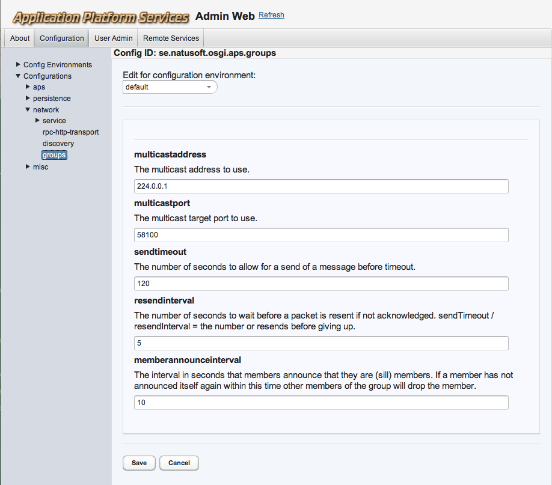

# APSGroups

Provides network groups where named groups can be joined as members and then send and 
receive data messages to the group. This is based on multicast and provides a verified
multicast delivery with acknowledgements of receive to the sender and resends if needed.
The sender will get an exception if not all members receive all data. Member actuality
is handled by members announcing themselves relatively often and will be removed when
an announcement does not come in expected time. So if a member dies unexpectedly
(network goes down, etc) its membership will resolve rather quickly. Members also
tries to inform the group when they are doing a controlled exit. 

Please note that this does not support streaming! That would require
a far more complex protocol. APSGroups waits in all packets of a message before delivering
the message.

## OSGi service usage

The APSGroupsService API looks like this:

    public interface APSGroupsService {
        /**
         * Joins a group.
         *
         * @param name The name of the group to join.
         *
         * @return A GroupMember that provides the API for sending and receiving data in the 
         *         group.
         *
         * @throws java.io.IOException The unavoidable one!
         */
        GroupMember joinGroup(String name) throws IOException;

        /**
         * Leaves as member of group.
         *
         * @param groupMember The GroupMember returned when joined.
         *
         * @throws java.io.IOException The unavoidable one!
         */
        void leaveGroup(GroupMember groupMember) throws IOException;
    }
 
**Getting the service**

	APSServiceTracker<APSGroupService> apsGroupsServiceTracker = 
		new APSServiceTracker<APSGroupsService>(bundleContext, APSConfigService.class,
		APSServiceTracker.LARGE_TIMEOUT);
	APSGroupsService apsGroupsService = apsGroupsServiceTracker.getWrappedService();
	
**Joining a group**

	GroupMember groupMember = apsGroupsService.joinGroup(”mygroup”);
	
**Sending a message**

To send a message you create a message, get its output stream and write whatever you want to send on that
output stream, close it and then send it. *Note* that since the content of the message is any data you want, 
all members of the groups must know how the data sent looks like. In other words, you have to define your
own message protocol for your messages. Note that you can wrap the OutputStream in an ObjectOutputStream
and serialize any java object you want.
	
	Message message = groupMember.createNewMessage();
	OutputStream msgDataStream = message.getOutputStream();
	try {
		...
		msgDataStream.close();
		groupMember.sendMessage(message);
	}
	catch (IOException ioe) {
		...
	}
	
Note that the `groupMember.sendMessage(message)` does throw an IOException on failure to deliver the message to all members.

**Receiving a message**

To receive a message you have to register a message listener with the GroupMember object.

	MessageListener msgListener = new MyMsgListener();
	groupMember.addMessageListener(myMsgListener); 

and then handle received messages:

	public class MyMsgListener implements MessageListener {
		public void messageReceived(Message message) {
			InputStream msgDataStream = message.getInputStream();
			...
		}
	}

**Leaving a group**

	apsGroupsService.leaveGroup(groupMember);
	
## Library usage

The bundle jar file can also be used as a library outside of an OSGi server, with an API that has no other dependencies than what
is in the jar. The API is then slightly different, and resides under the se.natusoft.apsgroups package.

**Setting up**

	APSGroups apsGroups = new APSGroups(config, logger);
	apsGroups.connect();
	
The config passed as argument to APSGroups will be explained further down under ”Configuration”.

The *logger* is an instance of an implementation of the APSGroupsLogger interface. Either you provide your own
implementation of that or your use the APSGroupsSystemOutLogger implementation. 
	
**Joining a group**

	GroupMember groupMember = apsGroups.joinGroup(”mygroup”);

**Sending and receiving messages**

Sending and receiving works exactly like the OSGi examples above. 

**Leaving a group**

	apsGroups.leaveGroup(groupMember);

**Shutting down**

	apsGroups.disconnect();
	
## Net time

All APSGroups instances connected will try to sync their time. I call this synced time ”net time”. 

It works like this: When an APSGroups instance comes up it waits a while for NET_TIME packets. If it gets such a packet then it enters
receive mode and takes the time in the received NET_TIME packet and stores a diff to that time and local time. This diff can then be
used to translate back and forth between local and net time. If no such packet arrives in expected time it enters send mode and starts
sending NET_TIME packets itself using its current net time. If a NET_TIME packet is received when in send mode it directly goes over
to listen mode. If in listen mode and no NET_TIME packet comes in reasonable time it goes over to send mode. So among all instances
on the network only one is responsible for sending NET_TIME. If that instance leaves then there might be a short fight for succession,
but it will resolve itself rather quickly.

The GroupMember contains the following API to support net time:

    /**
     * @return The current time as net time.
     */
    NetTime getNow();

    /**
     * Creates from milliseconds in net time.
     *
     * @param netTimeMillis The net time milliseconds to create a NetTime for.
     */
    NetTime createFromNetTime(long netTimeMillis);

    /**
     * Creates from a Date in net time.
     *
     * @param netTimeDate The Date in net time to create a NetTime for.
     */
    NetTime createFromNetTime(Date netTimeDate);

    /**
     * Creates from milliseconds in local time.
     *
     * @param localTimeMillis The local time milliseconds to create a NetTime for.
     */
    NetTime createFromLocalTime(long localTimeMillis);

    /**
     * Creates from a Date in local time.
     *
     * @param localTimeDate The Date in local time to create a NetTime for.
     */
    NetTime createFromLocalTime(Date localTimeDate);

and the NetTime API looks like this:

    interface NetTime {
        /**
         * Returns the number of milliseconds since Januray 1, 1970 in net time.
         */
        public long getNetTime();

        /**
         * Returns the net time as a Date.
         */
        public Date getNetTimeDate();

        /**
         * Returns the net time as a Calendar.
         */
        public Calendar getNetTimeCalendar();

        /**
         * Returns the net time as a Calendar.
         *
         * @param locale The locale to use.
         */
        public Calendar getNetTimeCalendar(Locale locale);

        /**
         * Converts the net time to local time and returns as a Date.
         */
        public Date getLocalTimeDate();

        /**
         * Converts the net time to local time and returns as a Calendar.
         */
        public Calendar getLocalTimeCalendar();

        /**
         * Converts the net time to local time and returns as a Calendar.
         *
         * @param locale The locale to use.
         */
        public Calendar getLocalTimeCalendar(Locale locale);
    }

## Configuration

### OSGi service 

The OSGi service provides a configuration model that gets managed by the APSConfigService. It can be configured in the APS adminweb
(http://host:port/apsadminweb/). Here is a screenshot of the config admin:

### Library 

The library wants an implementation of the APSGroupsConfig interface as its first argument to APSGroups(config, logger) constructor.
Either you implement your own or use the APSGroupsConfigProvider implementation. This is a plain java bean with both setters and
getters for the config values. It comes with quite reasonable default values. It contains exactly the same properties as shown in
the picture above.

