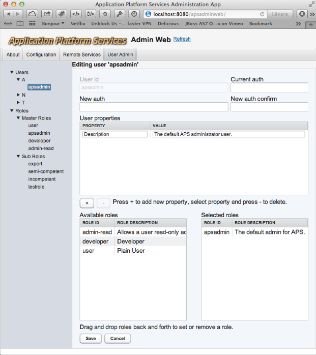

# APSUserAdminWeb

APSUserAdminWeb provides user and group administration for the _APSSimpleUserService_.

Users are splitt into groups of the first character in the userid to make them a little bit easier to find if there are many. So all userids starting with ’a’ or ’A’ will be under Users/A and so on.

__Warning:__ For the roles it is fully possible to create circular dependencies! __Dont!__ (There is room for improvement on this point!)

There is not anything more to say about this. It should be seflexplanatory!

